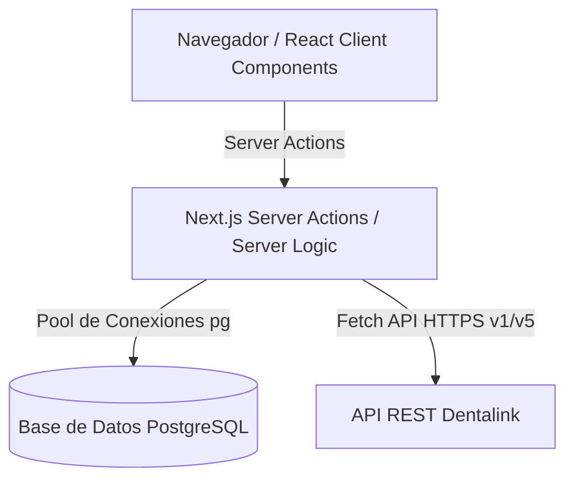
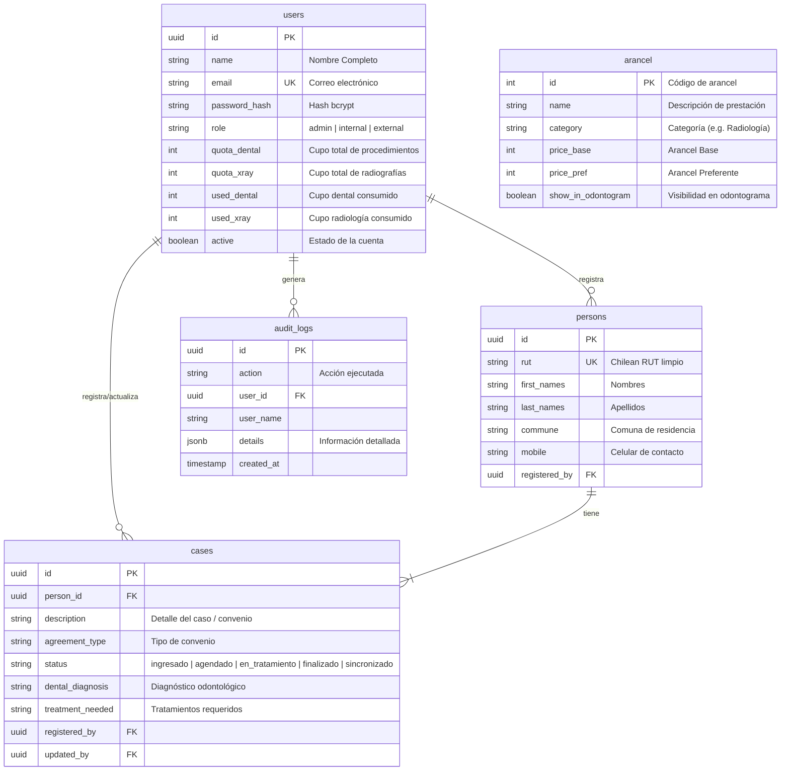

# Documentación del Sistema de Derivación Digital

Este documento describe la arquitectura, el modelo de datos, los flujos de negocio clave y las integraciones del portal de Derivación Digital desarrollado para conectar la red asistencial entre el **Policlínico Tabancura** y la **La Municipalidad de Vitacura**.

---

## 1. Arquitectura General

La aplicación está construida sobre **Next.js (App Router)** utilizando una arquitectura moderna sin APIs REST intermedias para las operaciones internas, apoyándose en **Server Actions** seguros y tipados en TypeScript.



### Capas del Proyecto

* **`/src/app`**: Estructura de rutas, páginas de servidor y endpoints lógicos.
  - **`/actions`**: Server Actions independientes que encapsulan la lógica de negocio y base de datos (e.g. `caseActions.ts`, `userActions.ts`).
  - **`/dashboard`**: Rutas protegidas bajo el layout administrativo (`/users`, `/cases`, `/aranceles`, `/audit`).
* **`/src/components`**: Componentes visuales interactivos de React (Client Components).
* **`/src/lib`**: Inicializaciones globales, utilidades auxiliares y utilidades de sesión/criptografía.

---

## 2. Modelo de Base de Datos

El sistema utiliza una base de datos **PostgreSQL** para persistir la información de los usuarios, personas físicas, casos sociales de derivación, catálogo de aranceles y bitácoras de auditoría.



---

## 3. Lógica de Negocio y Control de Cupos

El sistema tiene implementado un estricto control de cupos por profesional derivador para las clasificaciones de **Procedimientos Dentales** y **Radiología (Rayos X)**.

### Flujo de Descuento de Cupos

1. **Definición de Cupos (Administrador):**
   - El administrador asigna una cuota inicial de prestaciones dentales (`quota_dental`) y de radiografías (`quota_xray`) a cada profesional (`external`).
2. **Selección de Tratamientos en el Odontograma:**
   - Durante la derivación, el profesional selecciona las piezas dentales y los tratamientos asociados en el **Odontograma Interactivo**.
   - El sistema unifica la lista de IDs de prestaciones seleccionadas (usando el arancel base/general).
3. **Validación Previa al Registro (`registerPersonAndCaseAction`):**
   - Antes de insertar el caso, se ejecuta una transacción en la base de datos.
   - Se clasifican las prestaciones seleccionadas: las de la categoría `"Radiología"` suman al contador de Rayos X, y cualquier otra categoría suma al contador de Procedimientos Dentales.
   - Si el profesional excede su cupo restante disponible, la transacción se aborta (`ROLLBACK`) y se retorna un mensaje descriptivo de error.
   - Si hay cupo suficiente, se incrementan los contadores `used_dental` y `used_xray` del usuario y se inserta el caso.

---

## 4. Integración con Dentalink

El módulo en [dentalinkActions.ts](file:///c:/Users/EQUIPO/Desktop/Sandbox/devPythonActual/pt.cl-vitacura/src/app/actions/dentalinkActions.ts) permite la sincronización bidireccional de fichas de pacientes y tratamientos clínicos usando la API REST v1/v5 de Dentalink.

### Características de la Integración

* **Búsqueda Robusta por RUT:** Para evitar duplicaciones debido a diferencias en el formato del RUT ingresado, el sistema consulta en paralelo 3 formatos posibles:
  1. RUT Limpio (sólo números y dígito verificador): `12345678K`
  2. RUT con Guion: `12345678-K`
  3. RUT con Puntos y Guion: `12.345.678-K`
* **Sincronización de Ficha de Paciente:** Si el paciente no existe en Dentalink, se crea de forma automática mediante un payload estandarizado (`POST /pacientes`).
* **Ingreso Automático de Tratamientos:** Se permite la creación de planes de tratamiento (`POST /tratamientos`) y la posterior inserción de sus detalles de prestaciones clínicas asociadas con un descuento del 100% (costo cero para convenios preferenciales).

---

## 5. Diseño y Tokens Visuales (CSS)

La estética del sitio está inspirada en un laboratorio clínico de alta gama, utilizando un enfoque limpio y premium basado en variables de CSS definidas en [globals.css](file:///c:/Users/EQUIPO/Desktop/Sandbox/devPythonActual/pt.cl-vitacura/src/app/globals.css).

### Paleta y Tokens de Diseño

* **Colores Principales:**
  - Verde Clínico Primario: `#10b981` (representa salud y digitalización).
  - Azul Corporativo: `#3b82f6` (usado para acciones y estados de agenda).
  - Púrpura de Convenios: `#a855f7` (radiología y especialidades).
* **Efecto de Vidrio (Glassmorphism):**
  - Fondo Glass: `rgba(255, 255, 255, 0.45)` (con filtros de desenfoque `backdrop-filter: blur(20px)`).
  - Bordes Suaves: `rgba(255, 255, 255, 0.4)` que otorgan un relieve tridimensional premium.
* **Componentes de Tabla y Formularios:**
  - Tablas con sombreado dinámico al pasar el cursor (`clinical-table tr:hover`).
  - Inputs minimalistas con transiciones suaves en el foco para mejorar la retroalimentación al usuario.

---

## 6. Comandos de Operación

* **Iniciar Servidor de Desarrollo:**
  ```bash
  npm run dev
  ```
* **Compilar para Producción:**
  ```bash
  npm run build
  ```
* **Iniciar Servidor en Producción:**
  ```bash
  npm run start
  ```
* **Inicializar/Re-establecer Base de Datos:**
  ```bash
  npx tsx src/lib/setup-db.ts
  ```
